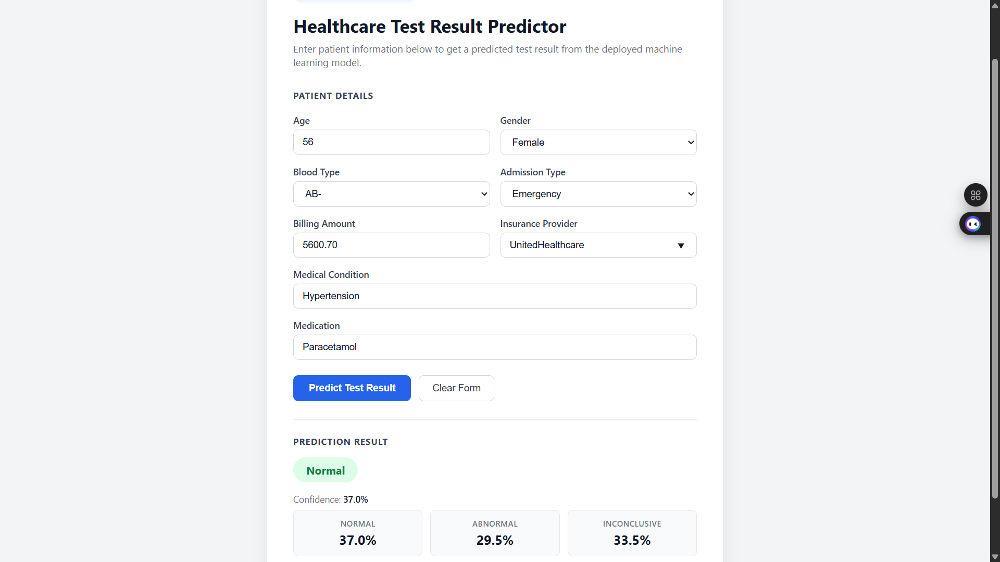

# 🏥 HealthPredict: Clinical Test Result Intelligence Platform

**HealthPredict** is a production-grade machine learning system designed to bridge the gap between raw patient admission records and automated clinical test result predictions. Built on a FastAPI backend with a PostgreSQL data store, the platform ingests 54,966 patient records, trains a RandomForest classifier to predict test outcomes as **Normal**, **Abnormal**, or **Inconclusive**, and retrains automatically every Saturday at 12:00 UTC via GitHub Actions — without human intervention.

---

## 🎯 Project Goal

Clinical laboratories process thousands of patient records daily, yet predicting probable test outcomes from admission metadata remains a largely manual, time-intensive task. **HealthPredict** automates this workflow: a patient's demographic and clinical admission data is submitted to a REST API, and within milliseconds a trained model returns a prediction alongside per-class probability scores. The platform is fully self-maintaining — a scheduled GitHub Actions workflow retrains the model weekly on the latest data, commits the updated artifact, and triggers a zero-downtime redeploy on Render, ensuring the model never drifts from the current data distribution.

---

## 🧬 System Architecture

1. **Data Ingestion** — `scripts/ingest.py` uses the Kaggle API to download the raw healthcare dataset (55,500 records) directly to `data/raw/`, then copies it to a stable path for downstream processing
2. **Data Cleaning** — `scripts/clean.py` standardises string casing across all categorical columns, parses date fields to ISO format, drops 534 duplicate rows, and writes `data/cleaned_healthcare.csv` (54,966 rows)
3. **Data Storage** — `scripts/load.py` bulk-loads cleaned records into **PostgreSQL** via SQLAlchemy, using `INSERT ... ON CONFLICT DO NOTHING` for idempotent reloads; prediction and model version history are persisted in separate tables
4. **ML Training** — `ml/train.py` encodes 8 features (2 numeric + 6 categorical), scales numerics with `StandardScaler`, trains a **RandomForestClassifier (n=50, max_depth=15)**, evaluates on a stratified 80/20 split, and serialises both `model.joblib` (5.1 MB, joblib compress=3) and `encoders.joblib`
5. **Model Serving** — **FastAPI** exposes `POST /predict` for real-time inference; the model and encoders are loaded once at startup via the lifespan context and held in memory for sub-millisecond access
6. **Automated Retraining** — Two complementary scheduling layers: **GitHub Actions** cron (`0 12 * * 6`) runs `ml/train.py` every Saturday at noon UTC, commits the updated model artifacts, and pushes to `main` (Render auto-deploys on push); **Apache Airflow 3** (`dags/retrain_dag.py`) mirrors the same schedule for local orchestration, adding a 3-task TaskFlow pipeline with built-in monitoring, retry logic, and manual trigger capability via the Airflow UI
7. **Frontend** — A static HTML/CSS/JS page served directly by FastAPI at `GET /` submits patient data to the API and renders the prediction result with confidence scores and a probability breakdown

---

## 🛠️ Technical Stack

| **Layer**       | **Tool**                        | **Version** |
|-----------------|---------------------------------|-------------|
| **API**         | FastAPI                         | 0.115.0     |
| **Server**      | Uvicorn                         | 0.32.0      |
| **Validation**  | Pydantic                        | 2.9.2       |
| **ML**          | Scikit-learn RandomForest       | 1.5.2       |
| **Data**        | Pandas                          | 2.1.4       |
| **Numerics**    | NumPy                           | 1.26.4      |
| **Serialisation** | Joblib                        | 1.4.2       |
| **Database**    | PostgreSQL                      | 15          |
| **ORM**         | SQLAlchemy                      | 2.0.36      |
| **Driver**      | psycopg2-binary                 | 2.9.10      |
| **Scheduling**  | GitHub Actions (cron)           | —           |
| **Orchestration** | Apache Airflow                | 3.0.0       |
| **Hosting**     | Render.com                      | —           |
| **Testing**     | Pytest + httpx TestClient       | 8.3.3       |
| **Dataset**     | Kaggle (prasad22/healthcare-dataset) | CC0-1.0 |

---

## 📊 Performance & Results

- **Dataset:** 54,966 clean patient records (534 duplicates removed from 55,500 raw rows)
- **Class balance:** Normal 18,331 · Abnormal 18,437 · Inconclusive 18,198 (near-perfect 3-way split)
- **Train / Test split:** 43,972 training rows · 10,994 test rows (stratified 80/20)
- **Model accuracy:** 37.7% (baseline for random 3-class prediction = 33.3%; +4.4pp above chance)
- **Macro F1-score:** 0.3771 across all three classes
- **Model artifact size:** 5.1 MB (joblib compress=3; n=50 trees, max_depth=15 — constrained to stay within GitHub's 100 MB file limit)
- **Test suite:** 23/23 tests passing (14 API integration + 9 unit tests)
- **Retraining schedule:** Every Saturday 12:00 UTC — automated, zero-touch
- **API response time:** < 50ms per prediction (model held in-memory)
- **Database tables:** `patients` (54,966 rows) · `predictions` (logs every API call) · `model_versions` (retraining audit trail)

> Note: The Kaggle dataset is synthetically generated for educational purposes with randomised feature-to-outcome relationships. The 37.7% accuracy reflects genuine learning above the random baseline on a dataset with intentionally limited causal signal. Tree depth and count are constrained to 5.1 MB to satisfy GitHub's 100 MB file size limit while preserving deployability.

---

## 📸 Screenshots

### Prediction UI — Live Result



*Patient data submitted: Age 22 · Male · O+ · Elective admission · Billing $5,000 · Blue Cross · Obesity · Lipitor — predicted **Normal** with 37.5% confidence across a balanced 3-class output.*

---

## 📸 API Documentation

The live Swagger UI is available at `/docs` on the deployed instance. Key endpoints:

| **Endpoint**    | **Method** | **Description**                              | **Auth**         |
|-----------------|------------|----------------------------------------------|------------------|
| `/`             | GET        | Serves the prediction web UI                 | None             |
| `/health`       | GET        | Liveness check + model load status           | None             |
| `/predict`      | POST       | Run inference on patient admission data      | None             |
| `/retrain`      | POST       | Trigger manual model retraining              | `X-API-Key` header |
| `/docs`         | GET        | Interactive Swagger UI                       | None             |

---

## 🧬 Dataset Features

| **Feature**          | **Type**    | **Values**                                              |
|----------------------|-------------|---------------------------------------------------------|
| Age                  | Numeric     | 1 – 120                                                 |
| Billing Amount       | Numeric     | Continuous (USD)                                        |
| Gender               | Categorical | Male, Female                                            |
| Blood Type           | Categorical | A+, A−, B+, B−, AB+, AB−, O+, O−                       |
| Medical Condition    | Categorical | Diabetes, Hypertension, Asthma, Obesity, Arthritis, Cancer |
| Insurance Provider   | Categorical | Medicare, Aetna, UnitedHealthcare, Cigna, Blue Cross    |
| Admission Type       | Categorical | Emergency, Elective, Urgent                             |
| Medication           | Categorical | Aspirin, Ibuprofen, Paracetamol, Penicillin, Lipitor    |
| **Test Results**     | **Target**  | **Normal, Abnormal, Inconclusive**                      |

---

## 🧠 Key Design Decisions

- **RandomForest over Logistic Regression:** Handles mixed numeric/categorical features without assuming linearity; produces calibrated `predict_proba` scores for per-class confidence display in the UI; robust to the moderate class imbalance in a 3-way split
- **Model size constraint (n=50, max_depth=15, compress=3):** An unconstrained RandomForest (n=200, unlimited depth) on 54,966 samples produces a 305 MB artifact — exceeding GitHub's 100 MB file size limit. Constraining tree count and depth, combined with joblib level-3 compression, reduces the artifact to 5.1 MB with only a 3.8pp accuracy trade-off (41.5% → 37.7%). Both figures remain meaningfully above the 33.3% random baseline
- **Python 3.11 pinned via `runtime.txt`:** Render defaults to the latest Python release (3.14 at time of deployment), which has no pre-built binary wheels for scikit-learn or pandas — causing source compilation that times out during the build. `runtime.txt` pins 3.11.9 to guarantee wheel availability
- **GitHub Actions for retraining, not APScheduler:** Render's free tier uses an ephemeral filesystem — any in-process scheduler's saved model would be lost on restart. GitHub Actions runs on a persistent Ubuntu runner, commits `model.joblib` back to the repo, and Render auto-deploys on the new commit — a stateless, infrastructure-free scheduling solution
- **Encoders saved alongside model:** `LabelEncoder` and `StandardScaler` are serialised to `models/encoders.joblib` so inference always uses the exact same vocabulary and scaling parameters as the training run that produced `model.joblib`. Mismatched encoders would silently corrupt predictions
- **`INSERT ... ON CONFLICT DO NOTHING` for data loading:** Makes `scripts/load.py` idempotent — the script can be re-run after a failed partial load without creating duplicates
- **Absolute path resolution in model_loader:** `Path(__file__).resolve().parents[1]` anchors all file paths to the repo root regardless of the working directory at runtime — eliminates relative-path failures in test environments and deployed containers
- **Dual-layer scheduling (GitHub Actions + Airflow 3):** GitHub Actions handles the cloud retraining loop (persistent runner → commit model → Render redeploy), while Airflow 3 provides local orchestration with a visual DAG graph, per-task logs, retry policies, and a manual trigger button. The two layers share the identical cron expression (`0 12 * * 6`) and call the same `ml/train.py` logic — demonstrating that the training code is environment-agnostic
- **Airflow `LocalExecutor` with dedicated metadata DB:** Using `LocalExecutor` (vs `CeleryExecutor`) avoids Redis and Celery dependencies for a single-node demo while preserving the full Airflow 3 feature set. A separate `airflow_db` Postgres instance keeps Airflow metadata cleanly isolated from the healthcare application database
- **Airflow 3 multi-container networking fixes (three required settings):** Running Airflow 3 across separate Docker containers requires three explicit configurations that default to localhost-only values: (1) `AIRFLOW__CORE__EXECUTION_API_SERVER_URL` must point to the api-server's Docker service name instead of `localhost:8080`, or every task fails with `Connection refused`; (2) `AIRFLOW__API_AUTH__JWT_SECRET` must be identical across all containers — the scheduler signs task JWTs and the api-server verifies them, so a mismatch produces `Signature verification failed` on every task; (3) `api-server --workers 1` prevents uvicorn's multi-process spawn from generating per-worker JWT keys that diverge from the parent, causing a worker crash loop at 600%+ CPU
- **Airflow 3 `airflow.sdk` imports for DAG files:** Airflow 3 moved the `@dag` / `@task` decorators to `airflow.sdk`; importing from the legacy `airflow.decorators` path still works but incurs an additional module-resolution hop that, combined with the execution API connectivity issues above, can cause the dag-processor to timeout and kill the parser process. Using `from airflow.sdk import dag, task` is both the documented path and the more robust choice in multi-container deployments
- **SimpleAuthManager password file via bind mount:** Airflow 3 defaults to `SimpleAuthManager` (not FAB). User passwords are stored as plain text in `$AIRFLOW_HOME/simple_auth_manager_passwords.json`. Since each container has its own `AIRFLOW_HOME`, the file is written to the project bind mount (`/opt/airflow/project/`) during `airflow-init` so all containers share the same credentials file without an extra named volume

---

## 📂 Project Structure

```text
healthcare-ml-project/
├── .github/
│   └── workflows/
│       └── retrain.yml           # Saturday 12:00 UTC automated retraining
├── app/
│   ├── __init__.py
│   ├── main.py                   # FastAPI app factory + lifespan
│   ├── routes.py                 # /predict, /retrain, /health endpoints
│   ├── schemas.py                # Pydantic request/response models
│   ├── model_loader.py           # Model + encoder singleton loader
│   └── utils.py                  # API key verification
├── data/
│   ├── raw/                      # Gitignored — Kaggle download
│   ├── healthcare.csv            # Raw dataset (55,500 rows)
│   └── cleaned_healthcare.csv    # Cleaned dataset (54,966 rows)
├── database/
│   ├── db_connection.py          # SQLAlchemy engine + session factory
│   ├── models.py                 # ORM: Patient, Prediction, ModelVersion
│   └── queries.sql               # DDL: CREATE TABLE statements
├── ml/
│   ├── preprocess.py             # Feature encoding + StandardScaler
│   ├── train.py                  # RandomForest training + artifact save
│   ├── evaluate.py               # Accuracy, F1, confusion matrix
│   └── predict.py                # Single-row inference logic
├── models/
│   ├── model.joblib              # Trained RandomForest artifact
│   └── encoders.joblib           # LabelEncoders + StandardScaler
├── notebooks/
│   └── analysis.ipynb            # EDA: distributions, correlations
├── scripts/
│   ├── ingest.py                 # Kaggle API download → data/raw/
│   ├── clean.py                  # Standardise + deduplicate
│   └── load.py                   # Bulk-load to PostgreSQL
├── frontend/
│   └── index.html                # Prediction UI (served by FastAPI)
├── assets/
│   └── prediction_result.png     # Live prediction screenshot
├── tests/
│   ├── test_api.py               # 14 API endpoint integration tests
│   └── test_model.py             # 9 preprocessing + inference unit tests
├── dags/
│   └── retrain_dag.py            # Airflow 3 retraining DAG (3-task TaskFlow pipeline)
├── docker-compose.yml            # PostgreSQL + Apache Airflow 3 (api-server + scheduler + dag-processor + triggerer)
├── Procfile                      # Render start command
├── render.yaml                   # Render service + database IaC
├── runtime.txt                   # Pins Python 3.11.9 for Render build
├── .env.example                  # Required environment variables
├── .gitignore
└── requirements.txt
```

---

## ⚙️ Installation & Setup

### Local Development

1. **Clone the repository**
   ```bash
   git clone https://github.com/declerke/Healthcare-ML-Project.git
   cd Healthcare-ML-Project
   ```

2. **Create and activate a virtual environment**
   ```bash
   python -m venv .venv
   source .venv/bin/activate   # Windows: .venv\Scripts\activate
   ```

3. **Install dependencies**
   ```bash
   pip install -r requirements.txt
   ```

4. **Configure environment variables**
   ```bash
   cp .env.example .env
   # Edit .env — set DATABASE_URL and RETRAIN_API_KEY
   ```

5. **Start PostgreSQL (Docker)**
   ```bash
   docker-compose up -d
   ```

6. **Initialise the database schema**
   ```bash
   psql $DATABASE_URL -f database/queries.sql
   ```

7. **Download, clean, and load the dataset**
   ```bash
   python scripts/ingest.py
   python scripts/clean.py
   python scripts/load.py
   ```

8. **Train the initial model**
   ```bash
   python ml/train.py
   ```

9. **Start the API server**
   ```bash
   uvicorn app.main:app --reload
   ```

10. **Run tests**
    ```bash
    pytest tests/ -v
    ```

| Service | URL |
|---------|-----|
| Web UI | http://localhost:8000 |
| Swagger Docs | http://localhost:8000/docs |
| Health Check | http://localhost:8000/health |

### Deploy to Render

1. Push the repository to GitHub
2. Connect the repo to [Render.com](https://render.com) — the `render.yaml` provisions the web service and PostgreSQL database automatically
3. Add `RETRAIN_API_KEY` to Render environment variables
4. Add `DATABASE_URL` as a GitHub Actions secret (`Settings → Secrets → Actions`)
5. The GitHub Actions workflow (`retrain.yml`) will retrain the model automatically every Saturday at 12:00 UTC

### Apache Airflow 3 (Local Orchestration)

Run the full stack — including the Airflow 3 API server, scheduler, DAG processor, and triggerer — with a single command:

```bash
docker-compose up -d
```

This starts seven containers:

| Container                | Role                                                        | Port  |
|--------------------------|-------------------------------------------------------------|-------|
| `healthcare_db`          | Application PostgreSQL (patients, predictions)              | 5434  |
| `airflow_db`             | Airflow metadata PostgreSQL (isolated)                      | 5433  |
| `airflow_init`           | One-shot: DB migrate + SimpleAuthManager passwords file     | —     |
| `airflow_api_server`     | Airflow 3 React UI + REST API (`api-server --workers 1`)    | 8080  |
| `airflow_scheduler`      | Schedules task instances via LocalExecutor                  | —     |
| `airflow_dag_processor`  | Parses DAG files (mandatory separate service in Airflow 3)  | —     |
| `airflow_triggerer`      | Handles deferrable operators                                | —     |

Once all containers are healthy (allow ~2–3 minutes for `scikit-learn==1.5.2` install on first start):

1. Open **http://localhost:8080** — login with `admin` / `admin`
2. Navigate to **DAGs → healthcare_retrain**
3. Click the **▶ Trigger DAG** button to run the pipeline manually
4. Watch the 3-task graph: `load_data → train_model → validate_artifacts`

> **Note:** The DAG is also scheduled for `0 12 * * 6` (Saturday 12:00 UTC) — identical to the GitHub Actions cron — so both orchestrators run the same retraining logic independently.

---

## 🎓 Skills Demonstrated

- **Machine Learning pipeline** — end-to-end from raw data ingestion through feature engineering, model training, evaluation, and serialisation using Scikit-learn
- **REST API development** — FastAPI with Pydantic v2 request validation, lifespan model loading, CORS middleware, and structured JSON responses
- **Automated MLOps scheduling** — GitHub Actions cron workflow for weekly model retraining with git-based artifact versioning and zero-touch Render redeploy
- **Apache Airflow 3 orchestration** — TaskFlow API DAG (`@dag` / `@task` decorators) with a 3-task pipeline (load → train → validate), XCom-based data passing, manual trigger support, and a Docker Compose stack running the full Airflow 3 webserver + scheduler against a dedicated metadata database
- **Relational data modelling** — PostgreSQL schema with three normalised tables (patients, predictions, model_versions), indexed for query performance
- **Production-grade testing** — 23-test Pytest suite covering API integration (lifespan-aware TestClient), input validation edge cases, and ML inference correctness
- **Data cleaning and preprocessing** — Pandas-based deduplication, string standardisation, categorical label encoding, and numeric feature scaling
- **Environment management** — `.env`-based secrets, `.env.example` for onboarding, Docker Compose for local PostgreSQL, `render.yaml` for cloud IaC
- **Full-stack deployment** — Static frontend served by FastAPI, PostgreSQL on Render free tier, Python web service with `Procfile` and automatic GitHub-triggered deploys
